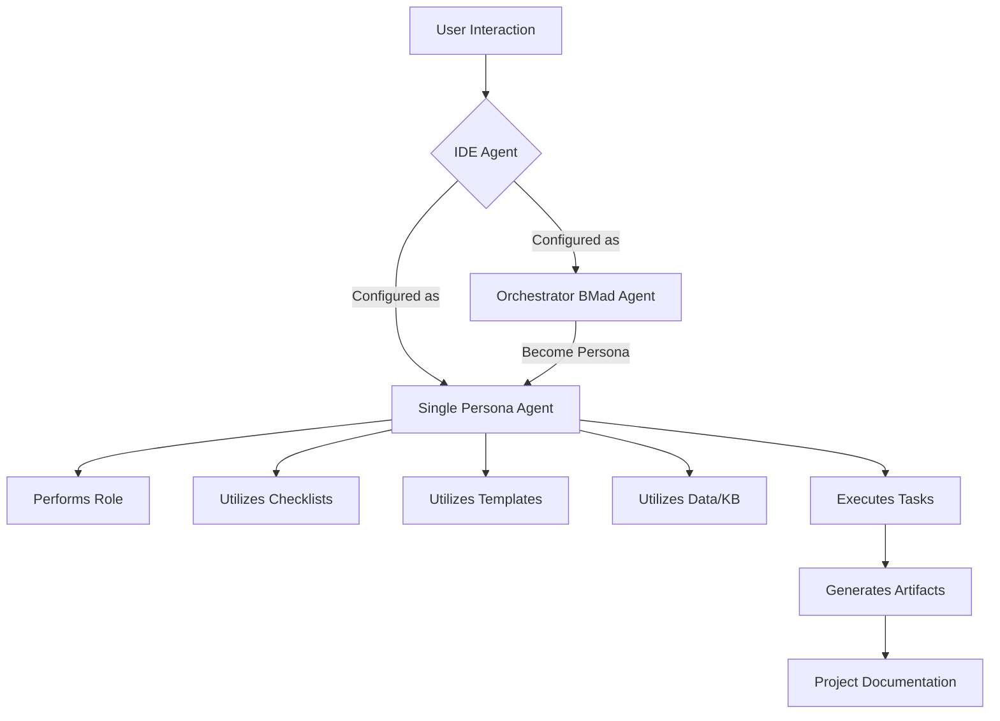

# Understanding the BMAD-Method Agentic Structure (IDE Workflow)

The BMAD-Method 3.1 (Breakthrough Method of Agile AI-Driven Development) is a comprehensive framework designed to leverage specialized AI agents for planning, executing, and managing software projects. While it supports both web and IDE-based workflows, this document focuses specifically on its implementation and workflow within an Integrated Development Environment (IDE).

## Core Components of the BMAD-Method (IDE Context)

The BMAD-Method organizes its AI capabilities around several key components that interact to facilitate agile development:

1.  **Agents (Personas):** These are specialized AI entities, often referred to as "personas," each designed to fulfill a specific role within the development lifecycle (e.g., Developer, Scrum Master, Architect, Product Owner, Project Manager, Analyst). In the IDE context, these are typically represented by `.ide.md` files (e.g., `dev.ide.md`, `sm.ide.md`) located in the `bmad-agent/personas/` directory. These files contain the specific prompts and instructions that define the agent's behavior and capabilities. A key optimization for IDE agents is their size, typically kept under 6K characters to comply with IDE-specific limitations (e.g., Windsurf).

2.  **Orchestrator BMad Agent:** This is a central, "uber" agent (`ide-bmad-orchestrator.md`) that acts as a master controller. Its primary function is to "morph" or delegate tasks to other specific agents (personas) as needed. In an IDE, using the Orchestrator simplifies setup by reducing the need to configure numerous individual custom agent modes. A user can interact with the Orchestrator and instruct it to "become" a Dev Agent, an Architect Agent, etc., effectively switching the underlying AI's persona and capabilities.

3.  **Tasks:** Located in the `bmad-agent/tasks/` directory, tasks are self-contained instruction sets (markdown files) that enable agents to perform specific, often one-off, jobs. Their purpose is to prevent "agent bloat" by keeping less frequently used functionalities separate from the core persona definitions. Any capable IDE agent (either a standalone persona or the Orchestrator) can be instructed to execute a task by providing the task file content. Examples include running checklists, creating stories, sharding documents, or indexing libraries.

4.  **Checklists:** Found in `bmad-agent/checklists/`, these are markdown files containing structured guidance for agents. They ensure consistency and adherence to best practices during various development phases (e.g., `architect-checklist.md`, `story-dod-checklist.md`). Agents can be instructed to follow these checklists when performing relevant tasks.

5.  **Templates:** Stored in `bmad-agent/templates/`, these are pre-defined markdown structures for various project artifacts. Agents utilize these templates to generate consistent and well-formatted documents such as architecture designs (`architecture-tmpl.md`), Product Requirement Documents (PRDs - `prd-tmpl.md`), or user stories (`story-tmpl.md`).

6.  **Data/Knowledge Base:** The `bmad-agent/data/` directory contains supporting information, such as `bmad-kb.md` (a knowledge base) and `technical-preferences.txt`. This data can be leveraged by agents to inform their responses and generated content, ensuring consistency and adherence to project-specific guidelines.

## IDE Workflow Overview

The general workflow within an IDE using the BMAD-Method revolves around configuring custom agent modes and leveraging the structured assets within the `bmad-agent` folder.



### Detailed IDE Workflow

1.  **Project Initialization:** The first step is to copy the entire `bmad-agent` folder into the root of the development project. This makes all the necessary assets (personas, tasks, checklists, templates, data) accessible to the IDE's agent configuration.

2.  **Agent Configuration in IDE:**
    *   **Single Persona Agents:** For direct, specialized interactions, the content of a specific `.ide.md` persona file (e.g., `dev.ide.md` or `sm.ide.md`) is copied and pasted into the IDE's custom agent mode configuration. This sets up a dedicated agent with that persona's instructions. These agents are pre-configured to output architecture and PRD artifacts to `(project-root)/docs` and stories to `(project-root)/docs/stories`.
    *   **Orchestrator Agent:** To enable a more flexible and comprehensive workflow, the content of `ide-bmad-orchestrator.md` is used to configure a custom orchestrator agent mode in the IDE. This agent becomes the primary point of interaction for the user.

3.  **User Interaction and Agent Execution:**
    *   **Direct Interaction (Single Agent):** The user interacts directly with the configured single persona agent, providing prompts and receiving responses tailored to that agent's role.
    *   **Orchestrated Interaction:** The user interacts with the Orchestrator BMad Agent. When a different persona's capabilities are required, the user instructs the Orchestrator to "become" that specific persona. The Orchestrator then adopts the instructions and behaviors of the requested persona.

4.  **Task Execution:**
    *   **One-off Tasks:** For specific, less frequent actions, the user can drag a task file (from `bmad-agent/tasks/`) into the agent chat window and instruct the current agent (single persona or orchestrated) to execute that task. This allows for on-demand functionality without permanently embedding all instructions into every agent.
    *   **Agent-Initiated Tasks:** Agents, based on their programming and the user's prompts, can also initiate the execution of specific tasks to achieve their objectives (e.g., an SM agent might initiate a "create-next-story-task").

5.  **Leveraging Assets:** Throughout the workflow, agents (whether standalone or orchestrated) actively utilize the assets within the `bmad-agent` folder:
    *   They consult **checklists** to ensure all necessary steps are followed and criteria are met.
    *   They populate **templates** to generate structured project artifacts (PRDs, architecture documents, stories, etc.).
    *   They access the **data/knowledge base** for contextual information and technical preferences.

6.  **Artifact Generation:** The ultimate output of the agentic workflow is the generation of various project artifacts. These documents are typically saved to predefined locations within the project structure (e.g., `docs/`, `docs/stories/`), contributing to a comprehensive and well-documented project.

```mermaid
graph LR
    A[Start: User Copies bmad-agent to Project Root] --> B{Configure IDE Agent Mode};

    B --> C1[Option 1: Single Persona Agent];
    C1 --> C1a[Paste dev.ide.md / sm.ide.md content];
    C1a --> D1[User Interacts Directly with Persona Agent];

    B --> C2[Option 2: Orchestrator BMad Agent];
    C2 --> C2a[Paste ide-bmad-orchestrator.md content];
    C2a --> D2[User Interacts with Orchestrator];
    D2 --> D2a{Orchestrator "Becomes" Persona};
    D2a --> D1;

    D1 --> E{Agent Action};
    E --> E1[Generate Artifacts];
    E1 --> F1[Utilize Templates];
    E1 --> F2[Utilize Checklists];
    E1 --> F3[Utilize Data/KB];
    E1 --> G[Output to Project Docs/Stories];

    E --> E2[Execute Task];
    E2 --> F4[User Drags Task File];
    E2 --> F5[Agent Initiates Task];
    E2 --> G;

    G --> H[End: Comprehensive Project Documentation];
```

## Key Advantages of the IDE Workflow

*   **Local Control:** All agent configurations and assets reside locally within the project, offering greater control and privacy.
*   **IDE Integration:** Seamless integration with the developer's primary working environment, allowing for context-aware assistance.
*   **Reduced Bloat:** The task-based approach and orchestrator minimize the need for numerous, large custom agent configurations.
*   **Structured Output:** Consistent use of templates and checklists ensures high-quality, standardized project artifacts.
*   **Flexibility:** The ability to switch personas via the Orchestrator or execute one-off tasks provides a highly adaptable workflow for various development needs.

In summary, the BMAD-Method's IDE workflow provides a powerful, structured, and flexible framework for AI-driven development. By combining specialized agents, an orchestrator, and a rich set of tasks, checklists, and templates, it enables developers to streamline their processes and generate comprehensive project documentation directly within their development environment.
