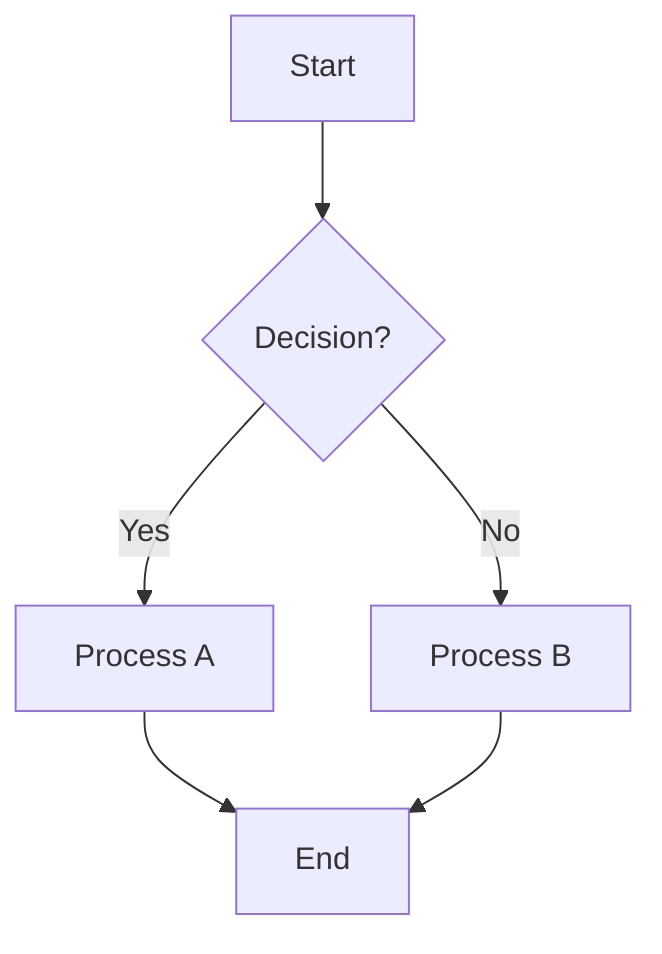
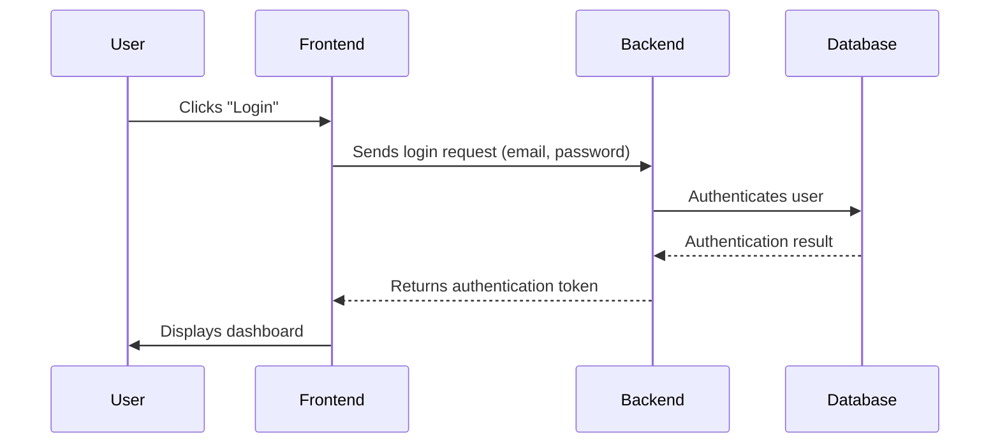
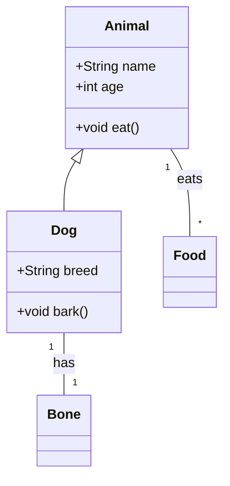

# Mermaid Diagram Demos

This document demonstrates four different types of diagrams that can be created using Mermaid syntax.

## 1. Flowchart

A flowchart describes a process or workflow.



## 2. Sequence Diagram

A sequence diagram shows the interactions between objects in a sequential order.



## 3. Class Diagram

A class diagram describes the structure of a system by showing the system's classes, their attributes, operations (or methods), and the relationships among objects.



## 4. Gantt Chart

A Gantt chart is a type of bar chart that illustrates a project schedule.

```mermaid
gantt
    dateFormat  YYYY-MM-DD
    title Project Schedule

    section Planning
    Define Scope           :a1, 2024-01-01, 5d
    Gather Requirements    :a2, after a1, 3d
    section Development
    Design Database        :b1, 2024-01-06, 4d
    Develop Backend API    :b2, after b1, 8d
    Develop Frontend UI    :b3, after b2, 10d
    section Testing
    Integration Testing    :c1, after b3, 5d
    User Acceptance Testing:c2, after c1, 3d
